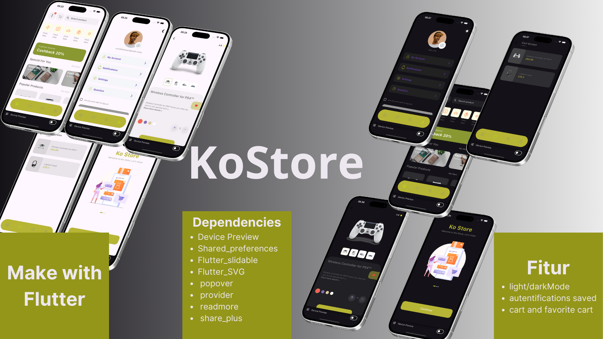

# koShop - Flutter E-Commerce UI

Welcome to **koShop**, a modern and minimalist e-commerce UI template built with Flutter. koShop is designed to provide a seamless and visually appealing shopping experience, complete with a responsive and customizable interface.

---

## 🚀 Features

- **Beautiful and Minimalist Design**: A clean, user-friendly interface for enhanced user experience.
- **Responsive Layout**: Optimized for mobile devices of various screen sizes.
- **Customizable Widgets**: Modular components that can be tailored to your needs.
- **Product Listings**: Attractive grid and list views for product display.
- **Cart Management**: Simple and intuitive cart functionality.
- **Light/Dark Mode**: Toggle between light and dark themes.
- **Authentication with Saved Credentials**: Secure user login with saved session data.
- **Cart and Favorite Management**: Add products to your cart or favorite list for a personalized experience.

---

## 📸 Screenshots

Showcase your app with screenshots here:

- **Home Screen**
  

